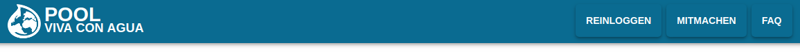
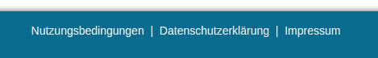

# heureka-widget-navigation-2021

[](https://www.npmjs.com/package/heureka-widget-navigation-2021) [](https://vuejs.org/)

> Implements a widget showing the menu of the Pool², an instance of the Heureka! architecture.

## Widgets
This package implements the following widgets. These widgets supporting a consistent navigation of Viva con Aguas Pool².
Use it to integrate the main menu and the footer of the Pool².

### Menu
The menu implements basic HTML and a bit of CSS code to show the buttons of the main menu. During the initiation of it,
the widget requests the content of the menu by an ajax call to Dispenser. That means all buttons with labels and targets,
but also the structure of the menu are received from a database managed by Dispenser. Its designed to stay at the top
of the page.



You can use it that way:
```xml
<WidgetTopNavigation :local-entries="localEntries" local-rule="concat" />
```
| Parameter | Type | Optional | Default | Description |
|-----------|------|----------|---------|-------------|
| `local-entries` | `[{'label': { 'de_DE': "neu", 'en_EN': "new" }, 'url': '/new', 'permission': [{ 'role': 'supporter' }]}]` | optional | `[]` | You can pass an array of local navigation entries. |
| `local-rule` | `'concat'` or `'replace'` | optional | `'concat'` | Defines if the local entries are concatinated (`'concat'`) or if the local entries replace the global navigation (`'replace'`). |
<br />
*There are no slots for this widget*

> Attention! Please consider the additional CSS style needed to create the default Pool² layout (see [Usage](#usage)).

### Footer
The footer contains a menu with secundary priority. It is designed to be the bottom of the page.



You can use it that way:
```xml
<WidgetBottomNavigation />
```
*There are no parameters for this widget*<br />
*There are no slots for this widget*

> Attention! Please consider the additional CSS style needed to create the default Pool² layout (see [Usage](#usage)).

## Installation

```bash
npm install --save heureka-widget-navigation-2021
```

## Usage

### Bundler (Webpack, Rollup)

Add the following to the component that uses the navigation:
```js
import { WidgetTopNavigation, WidgetBottomNavigation } from 'heureka-widget-navigation-2021';
import 'heureka-widget-navigation-2021/dist/heureka-widget-navigation-2021.css'

export default {
  name: 'App', // use the name of your component
  components: { WidgetTopNavigation, WidgetBottomNavigation }
}
```

Inside your template:
```xml
<template>
  <div id="app">
      <WidgetTopNavigation />
      <div id="content">
        <router-view/>
      </div>
      <WidgetBottomNavigation />
    </div>
</template>
```

Attention! This is required to have the menu at the top and the footer at the bottom of the page. The conatiner of menu,
footer and content has to displayed flexible and its content should be a column. The container of the content (in the
middle of menu and footer) has to grow:
```css
  #app {
    flex: 1;
    display: flex;
    flex-direction: column;
  }
  #content {
    flex-grow: 1;
    flex-shrink: 0;
    display: flex;
    overflow: auto;
  }
```

### Browser

```html
<!-- Include after Vue -->
<!-- Local files -->
<link rel="stylesheet" href="heureka-widget-navigation-2021/dist/heureka-widget-navigation-2021.css"></link>
<script src="heureka-widget-navigation-2021/dist/heureka-widget-navigation-2021.common.js"></script>

<!-- From CDN -->
<link rel="stylesheet" href="https://unpkg.com/heureka-widget-navigation-2021/dist/heureka-widget-navigation-2021.css"></link>
<script src="https://unpkg.com/heureka-widget-navigation-2021"></script>
```

#### Existing internationalization
If you already use [vue-i18n](https://www.npmjs.com/package/vue-i18n) to handle your internationalization and localization, we have to merge our messages into
yours. You can do this in your `main.js` before you instantiate your Vue App.

```js
import Vue from 'vue';
...
import VueI18n from 'vue-i18n';
import { WidgetTopNavigation, WidgetBottomNavigation } from 'heureka-widget-navigation-2021' 

Vue.use(VueI18n);

const i18n = new VueI18n({
    locale: locale,
    messages: {
        'en-US': require('@/lang/en_US'),
        'de-DE': require('@/lang/de_VCA'),
        'ja-JA': require('../node_modules/element-ui/lib/locale/lang/ja')
    }
});

// the most important line of code here
Vue.use(WidgetTopNavigation, { 'i18n': i18n })
Vue.use(WidgetBottomNavigation, { 'i18n': i18n })

/* eslint-disable no-new */

new Vue({
  ...
  i18n,
  components: { WidgetTopNavigation, WidgetBottomNavigation },
  ...
}).$mount('#app');
```
Afterwards, you don't have to use `Vue.use(WidgetTopNavigation)` or `Vue.use(WidgetBottomNavigation)` in your components again.

## Project setup
```
npm install
```

### Testing
Testing requires to publish the build artifacts. [Verdaccio](https://verdaccio.org/) can be used to setup a local npm registry. Afterwards, you just have to call
```shell
verdaccio
```
on your console and the local registry starts. Add
```json
"publishConfig": {
  "registry": "http://localhost:4873"
}
```
to the `package.json` and `npm publish` will use your local registry. In the target project (e.g. [Arise](https://github.com/SOTETO/arise)), you can use
```shell
npm install --save --registry http://localhost:4873 heureka-widget-navigation-2021
```
to install the package from your local registry.

### Compiles and hot-reloads for development
```
npm run serve
```

### Compiles and minifies for production
```
npm run build
```

### Lints and fixes files
```
npm run lint
```

### Customize configuration
See [Configuration Reference](https://cli.vuejs.org/config/).
